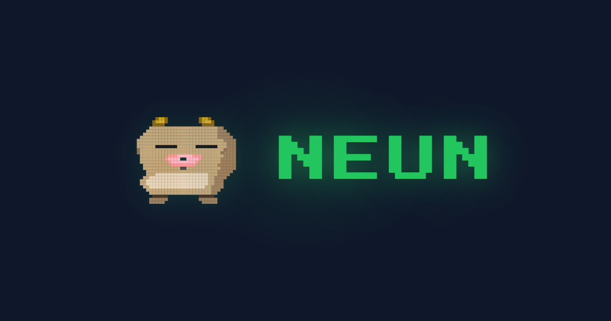

<div align="center">

# NEUN

### Web3 Job Market Intelligence Platform

*The smartest way to navigate Web3 careers*

[](https://neun.wtf)
[](#crawler-system)
[](#crawler-system)
[](https://github.com/greyisworking/web3-jobs-platform/actions)
[](LICENSE)

<br />

<!-- Replace with actual screenshot -->
<!--  -->

**[Explore Jobs](https://neun.wtf/jobs)** · **[Market Intelligence](https://neun.wtf/market)** · **[Career Quiz](https://neun.wtf/learn)**

</div>

---

## What is NEUN?

NEUN is a full-stack Web3 job intelligence platform that crawls **23 sources every 3 hours**, aggregates 1,000+ live positions, and surfaces market insights — skill heatmaps, salary trends, and personalized career recommendations.

Built entirely through **vibe coding by a non-developer** with an HRD & Web3 education background. No CS degree, no bootcamp — just Claude Code, determination, and an unreasonable amount of coffee.

---

## Key Features

| | Feature | Description |
|---|---|---|
| 🔍 | **Multi-source Crawlers** | 23 crawlers across 19 job boards + 4 ATS platforms (Lever, Greenhouse, Ashby, Getro), parallel execution with circuit breakers |
| 📊 | **Market Intelligence** | Interactive skill heatmap, chain-level trend analysis, demand/supply visualization with Recharts |
| 🎯 | **Career Path Quiz** | 3-step quiz → personalized Web3 career roadmap with matched jobs, salaries, and top skills |
| 🔐 | **Web3 Native Auth** | SIWE (Sign-In with Ethereum) wallet login + Google OAuth fallback |
| 📈 | **Admin Dashboard** | 13+ modules — crawl monitoring, quality scores, duplicate detection, content moderation |
| 🤖 | **AI-powered Reports** | Claude-generated monthly market reports, newsletter generator, job description sanitizer |
| ⚡ | **Production-grade** | ISR, edge-optimized, Sentry monitoring, Vercel Analytics & Speed Insights |
| 🌐 | **Ecosystem Views** | Browse by chain — Ethereum, Solana, Arbitrum, Avalanche, Base, Sui + cross-chain |

---

## Tech Stack

| Layer | Technologies |
|---|---|
| **Frontend** | Next.js 15, React 19, TypeScript 5, Tailwind CSS, Radix UI, Framer Motion, Recharts |
| **Backend** | Supabase (PostgreSQL + Auth + RLS), Next.js API Routes, Prisma ORM |
| **Crawlers** | Puppeteer, Cheerio, Axios, REST APIs (Lever/Greenhouse/Ashby/Getro), Circuit Breakers |
| **Web3** | wagmi, viem, SIWE, WalletConnect, MetaMask SDK, Coinbase Wallet SDK |
| **AI** | Anthropic Claude API — report generation, content summarization |
| **Infra** | Vercel (ISR + Edge), GitHub Actions (3h cron), Discord Webhooks, Sentry |
| **Testing** | Vitest, Playwright, k6 (load testing), custom data quality tests |

---

## Architecture

```
┌─────────────────────────────────────────────────────────┐
│                      DATA SOURCES                       │
│  Web3Career · CryptoJobs · RemoteOK · Wellfound · ...  │
│  Lever · Greenhouse · Ashby · Getro (ATS platforms)    │
└──────────────────────┬──────────────────────────────────┘
                       │ 23 crawlers (5 concurrent)
                       ▼
              ┌────────────────┐
              │   Sanitizer    │  HTML strip, zero-width cleanup,
              │   + Dedup      │  duplicate detection, quality scoring
              └───────┬────────┘
                      │
                      ▼
        ┌─────────────────────────────┐
        │     Supabase (PostgreSQL)   │
        │  Jobs · Bookmarks · Reports │
        │  RLS policies · Auth        │
        └──────┬──────────────┬───────┘
               │              │
               ▼              ▼
     ┌──────────────┐  ┌───────────────┐
     │   Next.js    │  │    Admin      │
     │   Frontend   │  │   Dashboard   │
     │              │  │               │
     │ • Job Search │  │ • Monitoring  │
     │ • Heatmap    │  │ • Quality QA  │
     │ • Quiz       │  │ • Newsletter  │
     │ • SIWE Auth  │  │ • AI Reports  │
     └──────────────┘  └───────────────┘
               │
               ▼
     ┌──────────────────┐
     │  GitHub Actions  │──→ Discord Alerts
     │  (every 3 hours) │
     └──────────────────┘
```

---

## Crawler System

The backbone of NEUN. A resilient, production-grade crawler pipeline.

| Metric | Value |
|---|---|
| **Sources** | 23 (19 job boards + 4 ATS platforms) |
| **Concurrency** | 5 parallel crawlers |
| **Schedule** | Every 3 hours via GitHub Actions |
| **Resilience** | Circuit breakers, auto-retry with backoff, proxy rotation |
| **Sanitization** | HTML strip, zero-width char cleanup, encoding normalization |
| **Quality** | Per-source quality scoring, duplicate detection, expired job cleanup |

### Sources

<details>
<summary><b>19 Job Boards</b></summary>

| Source | Chain/Focus |
|---|---|
| Web3Career | General Web3 |
| CryptoJobs | General Crypto |
| CryptoJobsList | General Crypto |
| CryptoCurrencyJobs | General Crypto |
| RemoteOK | Remote Web3 |
| Wellfound | Startup Jobs |
| Remote3 | Remote Web3 |
| JobStash | Web3 Aggregator |
| Ethereum.org | Ethereum Ecosystem |
| Arbitrum Jobs | Arbitrum L2 |
| Avalanche Jobs | Avalanche |
| Solana Jobs | Solana |
| Sui Jobs | Sui |
| Base HireChain | Base L2 |
| Superteam | Solana Ecosystem |
| RocketPunch | Korea |
| Wanted | Korea |
| Web3KR Jobs | Korea Web3 |
| Priority Companies | Top-tier direct |

</details>

<details>
<summary><b>4 ATS Platform Crawlers</b></summary>

| Platform | Type |
|---|---|
| Lever | REST API |
| Greenhouse | REST API |
| Ashby | REST API |
| Getro | REST API |

</details>

---

## Data Quality

Quality isn't optional — it's measured.

| Metric | Target | Current |
|---|---|---|
| JD Coverage | 95%+ | **99.6%** |
| HTML Error Rate | < 1% | **0%** |
| Quality Score Avg | 90+ | **94/100** |
| Auto-expire | 60 days | Active |
| Web3 Relevance | Filtered | Active |

---

## Getting Started

### Prerequisites

- Node.js 18+
- npm or yarn
- Supabase account (or local Supabase)

### Installation

```bash
git clone https://github.com/greyisworking/web3-jobs-platform.git
cd web3-jobs-platform
npm install
```

### Environment Variables

```bash
cp .env.example .env.local
```

**Required:**
```env
NEXT_PUBLIC_SUPABASE_URL=your_supabase_url
NEXT_PUBLIC_SUPABASE_ANON_KEY=your_anon_key
```

**Optional:**
```env
SUPABASE_SERVICE_ROLE_KEY=       # Server-side operations
ANTHROPIC_API_KEY=               # AI report generation
DISCORD_WEBHOOK_URL=             # Crawl notifications
NEXT_PUBLIC_WALLETCONNECT_PROJECT_ID=  # Wallet connection
```

### Run Locally

```bash
npm run dev          # Start dev server at localhost:3000
```

### Run Crawlers

```bash
npm run crawl        # Execute all crawlers
npm run schedule     # Start scheduler (3h interval)
npm run dev:all      # Dev server + scheduler
```

---

## Roadmap

- [x] Multi-source crawler system (23 sources)
- [x] Market intelligence dashboard with skill heatmap
- [x] Career path quiz with personalized recommendations
- [x] SIWE wallet login + Google OAuth
- [x] AI-powered monthly reports & newsletter generator
- [x] Admin dashboard (13+ modules)
- [x] Ecosystem-level browsing (ETH, SOL, ARB, AVAX, SUI, BASE)
- [x] Description sanitizer & quality scoring
- [ ] ZK credential verification
- [ ] On-chain resume / portfolio
- [ ] Token-gated job listings
- [ ] Public API

---

## License

[MIT](LICENSE)

---

<div align="center">

**Built with vibes by [@neunwtf](https://x.com/neunwtf)**

Non-developer. HRD + Web3 education background.<br/>
Entire platform built with Claude Code — from first commit to production.

*Chief Capybara Officer* 🦫

</div>
